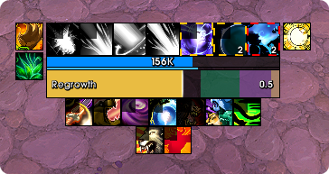
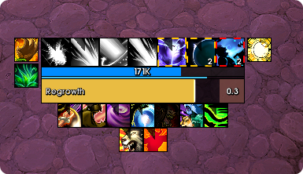

# CastQueueOverlay

A World of Warcraft addon that shades the trailing end of your cast bar to show
time values you normally have to guess at — chiefly your **spell queue window**,
the slice at the end of a cast during which your next spell is already accepted.

Retail only. Built and tested against **12.1.0 (Midnight)**, `## Interface: 120100`.


## What it draws

Three independent overlays, each a coloured band measured backwards from the end
of the bar. Any combination can be on at once.

| Overlay | Value |
|---|---|
| **SpellQueueWindow** | The `SpellQueueWindow` CVar, in milliseconds |
| **Latency** | Your home latency from `GetNetStats`, falling back to world latency |
| **Custom** | Any millisecond value you enter |

Each band is scaled against the duration of the cast currently in progress, so
the same 400ms window covers proportionally more of a fast cast than a slow one.

When several are enabled they are drawn stacked, widest underneath, so a wider
band never hides a narrower one.

### In game

<p align="center">
  
  
</p>

### Options

A tab per overlay, each with its own enable toggle, colour and opacity. The
SpellQueueWindow and Latency tabs show the value they currently resolve to, so
you can see what is actually being drawn; the Custom tab lets you type one.

Below that, a separate opacity for channelled casts — a channel starts with the
bar full, so the overlay begins underneath the fill, which is exactly when it
needs to be readable.

The window remembers where you put it.

> **Note:** the screenshots below predate the 2.3.0 redesign and still show the
> previous dark theme. The layout is the same; the colours and chrome are not.

<p align="center">
  
  
  
</p>

<p align="center">
  
</p>

## Usage

```
/cqo
```

Opens the options window. It has no arguments — everything is configured in the
window. There is also an entry in the standard AddOns settings list, which simply
opens the same window.

**In combat**, `/cqo` defers: it prints a message and opens the window once
combat ends. This is deliberate — the frame picker needs to grab the keyboard,
and that is blocked in combat.

## Cast bar support

Works with the default Blizzard cast bar out of the box, and with third-party
cast bars by frame name.

The **Select Frame** button starts a picker: hover any frame and its name is
shown live, `TAB` cycles through overlapping frames under the cursor, left click
selects, `Esc` cancels. The picker deliberately searches every region under the
cursor rather than only mouse-enabled ones, since most cast bars disable mouse
input.

Third-party bars are often created *after* login, so the addon keeps retrying to
bind to the frame you named for a short window after you log in, rather than
resolving once and silently falling back to Blizzard's bar.

Verified against EllesmereUI's `ERB_CastBar`.

## Installation

Copy the `CastQueueOverlay` folder into:

```
World of Warcraft/_retail_/Interface/AddOns/
```

Then `/reload` or restart the client.

## Licence

MIT — see [LICENSE](LICENSE).
